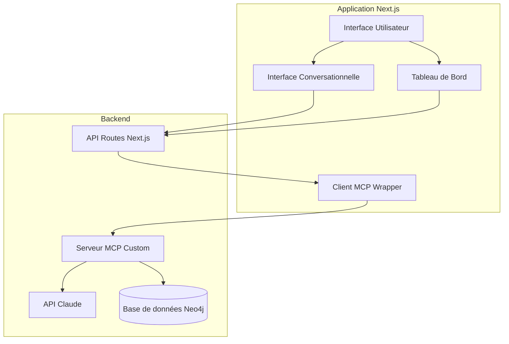

# Intégration du Model Context Protocol dans le Client Next.js

> **Note importante**: Ce document décrit l'approche traditionnelle d'implémentation du client MCP. À partir du Jalon 1.2, nous utilisons le Vercel AI SDK qui fournit une implémentation native du client MCP. Voir [VERCEL_AI_SDK_INTEGRATION.md](./VERCEL_AI_SDK_INTEGRATION.md) pour plus de détails sur la nouvelle approche.

Ce document décrit l'implémentation originale du Model Context Protocol (MCP) dans notre application client Next.js pour le Hub de Connaissances Personnel IA.

## Table des matières

1. [Vue d'ensemble](#vue-densemble)
2. [Architecture d'intégration](#architecture-dintégration)
3. [Implémentation du Client MCP](#implémentation-du-client-mcp)
4. [Interaction avec Neo4j via MCP](#interaction-avec-neo4j-via-mcp)
5. [Interface conversationnelle avec Claude](#interface-conversationnelle-avec-claude)
6. [Widgets dynamiques générés par l'IA](#widgets-dynamiques-générés-par-lia)
7. [Considérations de sécurité](#considérations-de-sécurité)
8. [Gestion des erreurs](#gestion-des-erreurs)

## Vue d'ensemble

Le Model Context Protocol (MCP) sert de pont entre notre application Next.js et diverses sources de données (notamment Neo4j) pour fournir du contexte à Claude, notre modèle d'IA conversationnel. 

L'intégration MCP permet à notre application de:
- Stocker des informations structurées dans Neo4j via une interface conversationnelle
- Interroger la base de données graphe de manière naturelle
- Générer des visualisations dynamiques (widgets) basées sur les données stockées
- Explorer des données à différents niveaux de résolution (brief, summary, content)

## Architecture d'intégration



## Implémentation du Client MCP

Le client MCP dans notre application Next.js est implémenté comme un wrapper qui facilite la communication avec le serveur MCP custom. 

### Structure des fichiers

```
src/
└── lib/
    └── mcp/
        ├── client.ts             # Client MCP principal
        ├── types.ts              # Types TypeScript pour MCP
        ├── tools/                # Définitions d'outils
        │   ├── graph-tools.ts    # Outils pour Neo4j
        │   └── widget-tools.ts   # Outils pour widgets
        └── utils/                # Utilitaires
            ├── json-rpc.ts       # Fonctions JSON-RPC
            └── session.ts        # Gestion de session
```

### Initialisation du client

```typescript
// src/lib/mcp/client.ts
import { JsonRpcRequest, JsonRpcResponse } from './types';

export class MCPClient {
  private endpoint: string;
  private sessionId: string | null = null;

  constructor(endpoint: string) {
    this.endpoint = endpoint;
  }

  /**
   * Initialise la connexion au serveur MCP
   */
  async initialize() {
    const request: JsonRpcRequest = {
      jsonrpc: "2.0",
      id: 1,
      method: "initialize",
      params: {
        protocolVersion: "2025-03-26",
        capabilities: {
          sampling: {},
          roots: {
            listChanged: true
          }
        },
        clientInfo: {
          name: "KnowledgeHubClient",
          version: "1.0.0"
        }
      }
    };

    const response = await this.sendRequest(request);
    
    // Vérification de la version et des capacités du serveur
    if (response.result) {
      // Stocker la session ID si fournie
      if (response.headers && response.headers['mcp-session-id']) {
        this.sessionId = response.headers['mcp-session-id'];
      }
      
      // Envoyer la notification initialized
      await this.sendNotification({
        jsonrpc: "2.0",
        method: "notifications/initialized"
      });
      
      return response.result;
    }
    
    throw new Error(`Initialization failed: ${response.error?.message}`);
  }

  /**
   * Envoie une requête au serveur MCP
   */
  async sendRequest(request: JsonRpcRequest): Promise<JsonRpcResponse> {
    const headers: Record<string, string> = {
      'Content-Type': 'application/json',
      'Accept': 'application/json, text/event-stream'
    };
    
    // Ajouter l'ID de session si disponible
    if (this.sessionId) {
      headers['Mcp-Session-Id'] = this.sessionId;
    }
    
    const response = await fetch(this.endpoint, {
      method: 'POST',
      headers,
      body: JSON.stringify(request)
    });
    
    // Traiter différents types de réponses (JSON ou SSE)
    const contentType = response.headers.get('Content-Type');
    
    if (contentType?.includes('application/json')) {
      return await response.json();
    } else if (contentType?.includes('text/event-stream')) {
      // Traitement du stream SSE
      return this.handleSSEResponse(response, request.id);
    }
    
    throw new Error(`Unsupported response content type: ${contentType}`);
  }
  
  // ... Autres méthodes pour les notifications, etc.
}
```

## Interaction avec Neo4j via MCP

L'interaction avec Neo4j est effectuée via le serveur MCP, qui expose des outils spécifiques pour interroger et mettre à jour le graphe.

### Écriture dans le graphe

```typescript
// Exemple d'utilisation dans une API route Next.js
import { MCPClient } from '@/lib/mcp/client';

export async function POST(req: Request) {
  const { prompt } = await req.json();
  const mcpClient = new MCPClient(process.env.MCP_SERVER_URL!);
  
  await mcpClient.initialize();
  
  // Appel pour créer une entrée dans Neo4j
  const response = await mcpClient.sendRequest({
    jsonrpc: "2.0",
    id: 2,
    method: "tools/call",
    params: {
      name: "updateGraph",
      arguments: {
        cypherQuery: `
          CREATE (e:Entry {
            id: $id,
            brief: $brief,
            summary: $summary,
            content: $content,
            type: $type,
            createdAt: datetime(),
            updatedAt: datetime()
          })
        `,
        params: {
          id: `entry-${Date.now()}`,
          brief: "Nouvelle entrée créée via interface chat",
          summary: "L'utilisateur a ajouté une nouvelle entrée depuis l'interface conversationnelle",
          content: prompt,
          type: "note"
        }
      }
    }
  });
  
  return Response.json({ success: true, data: response.result });
}
```

### Lecture depuis le graphe

```typescript
// Exemple d'utilisation dans une API route Next.js
export async function GET(req: Request) {
  const { searchParams } = new URL(req.url);
  const conceptName = searchParams.get('concept');
  
  const mcpClient = new MCPClient(process.env.MCP_SERVER_URL!);
  await mcpClient.initialize();
  
  // Appel pour récupérer des entrées liées à un concept
  const response = await mcpClient.sendRequest({
    jsonrpc: "2.0",
    id: 3,
    method: "tools/call",
    params: {
      name: "queryGraph",
      arguments: {
        cypherQuery: `
          MATCH (e:Entry)-[:MENTIONS]->(c:Concept {name: $conceptName})
          RETURN e.id, e.brief, e.summary, e.type, e.createdAt
          ORDER BY e.createdAt DESC
          LIMIT 10
        `,
        params: {
          conceptName
        }
      }
    }
  });
  
  return Response.json({ entries: response.result?.content });
}
```

## Interface conversationnelle avec Claude

L'intégration de Claude via MCP se fait en utilisant la capacité `sampling` du protocole. La communication est gérée par le serveur MCP qui sert d'intermédiaire entre le client et l'API Claude.

### Mise en place de l'interface de chat avec Vercel AI SDK

```typescript
// src/app/chat/page.tsx
'use client';

import { useChat } from 'ai/react';
import { useState } from 'react';
import { Message } from 'ai';

export default function ChatPage() {
  const { messages, input, handleInputChange, handleSubmit, isLoading } = useChat({
    api: '/api/chat',
    onResponse: (response) => {
      // Traitement optionnel de la réponse
    }
  });

  return (
    <div className="flex flex-col h-screen p-4">
      <h1 className="text-2xl font-bold mb-4">Conversation avec votre Knowledge Hub</h1>
      
      <div className="flex-1 overflow-y-auto mb-4 space-y-4">
        {messages.map((message: Message) => (
          <div 
            key={message.id} 
            className={`p-4 rounded-lg ${
              message.role === 'user' ? 'bg-blue-100 ml-auto' : 'bg-gray-100'
            } max-w-[80%]`}
          >
            {message.content}
          </div>
        ))}
      </div>
      
      <form onSubmit={handleSubmit} className="flex items-center">
        <input
          className="flex-1 p-2 border rounded-l-md focus:outline-none focus:ring-2 focus:ring-blue-500"
          value={input}
          placeholder="Posez une question ou ajoutez une note..."
          onChange={handleInputChange}
        />
        <button 
          type="submit" 
          className="bg-blue-500 text-white p-2 rounded-r-md"
          disabled={isLoading}
        >
          Envoyer
        </button>
      </form>
    </div>
  );
}
```

### Implémentation de l'API route de chat

```typescript
// src/app/api/chat/route.ts
import { StreamingTextResponse, Message as VercelAIMessage } from 'ai';
import { MCPClient } from '@/lib/mcp/client';

export async function POST(req: Request) {
  const { messages } = await req.json();
  const lastMessage = messages[messages.length - 1];
  
  const mcpClient = new MCPClient(process.env.MCP_SERVER_URL!);
  await mcpClient.initialize();
  
  // Appel au serveur MCP pour obtenir une réponse de Claude
  const response = await mcpClient.sendRequest({
    jsonrpc: "2.0",
    id: 4,
    method: "tools/call",
    params: {
      name: "simpleChat",
      arguments: {
        prompt: lastMessage.content,
        history: messages.slice(0, -1).map((m: VercelAIMessage) => ({
          role: m.role,
          content: m.content
        }))
      }
    }
  });
  
  // Créer un ReadableStream à partir de la réponse
  const stream = new ReadableStream({
    start(controller) {
      if (response.result?.content) {
        const text = response.result.content[0].text;
        controller.enqueue(new TextEncoder().encode(text));
        controller.close();
      } else {
        controller.error('No content in response');
      }
    }
  });
  
  return new StreamingTextResponse(stream);
}
```

## Widgets dynamiques générés par l'IA

Les widgets du tableau de bord sont générés par Claude à travers le protocole MCP, en utilisant des outils spécifiques.

### Outil de création de widget

```typescript
// src/lib/mcp/tools/widget-tools.ts
export interface WidgetDefinition {
  id: string;
  title: string;
  type: string;
  query?: string;  // Requête Cypher pour les widgets "live"
  data?: any;      // Données statiques pour les widgets non-live
  refreshInterval?: number; // Intervalle de rafraîchissement en ms
}

export interface WidgetToolArguments {
  widgetType: string;
  title: string;
  cypherQuery?: string;
  staticData?: any;
  refreshInterval?: number;
}
```

### Implémentation de l'API route pour les widgets

```typescript
// src/app/api/widgets/create/route.ts
import { MCPClient } from '@/lib/mcp/client';

export async function POST(req: Request) {
  const { prompt } = await req.json();
  
  const mcpClient = new MCPClient(process.env.MCP_SERVER_URL!);
  await mcpClient.initialize();
  
  // Appel à l'outil createWidget du serveur MCP
  const response = await mcpClient.sendRequest({
    jsonrpc: "2.0",
    id: 5,
    method: "tools/call",
    params: {
      name: "createWidget",
      arguments: {
        userRequest: prompt
      }
    }
  });
  
  if (response.result?.content) {
    try {
      // Le serveur MCP renvoie une définition de widget
      const widgetDefinition = JSON.parse(response.result.content[0].text);
      
      // Ici vous pourriez sauvegarder la définition ou la renvoyer directement
      return Response.json({ success: true, widget: widgetDefinition });
    } catch (error) {
      return Response.json({ success: false, error: "Invalid widget definition" }, { status: 400 });
    }
  }
  
  return Response.json({ success: false, error: "Failed to create widget" }, { status: 500 });
}
```

## Considérations de sécurité

### Validation des entrées

Toutes les entrées utilisateur doivent être validées avant d'être transmises au serveur MCP:

```typescript
// Exemple de validation
import { z } from 'zod';

const ChatInputSchema = z.object({
  messages: z.array(
    z.object({
      role: z.enum(['user', 'assistant']),
      content: z.string().max(4000)
    })
  ).max(100)
});

// Utilisation dans une API route
export async function POST(req: Request) {
  const body = await req.json();
  
  try {
    const validatedData = ChatInputSchema.parse(body);
    // Traitement avec données validées
  } catch (error) {
    return Response.json({ error: "Invalid input" }, { status: 400 });
  }
}
```

### Gestion des tokens d'API

Les tokens d'API ne doivent jamais être exposés au frontend:

```typescript
// Correct: configuration dans le backend seulement
const mcpClient = new MCPClient(process.env.MCP_SERVER_URL!);

// Incorrect: ne jamais faire ceci
const apiKey = process.env.NEXT_PUBLIC_API_KEY; // Exposé au client!
```

## Gestion des erreurs

```typescript
// Exemple de gestion des erreurs MCP
async function callMCPWithRetry(request: JsonRpcRequest, maxRetries = 3): Promise<JsonRpcResponse> {
  let attempts = 0;
  
  while (attempts < maxRetries) {
    try {
      const response = await mcpClient.sendRequest(request);
      
      if (response.error) {
        // Gestion des erreurs spécifiques au protocole
        if (response.error.code === -32002) {
          console.error("Resource not found:", response.error.message);
          throw new Error(response.error.message);
        } else if (response.error.code === -32603) {
          // Erreur interne du serveur, potentiellement retryable
          attempts++;
          await new Promise(resolve => setTimeout(resolve, 1000));
          continue;
        }
        
        throw new Error(`MCP Error: ${response.error.message}`);
      }
      
      return response;
    } catch (error) {
      if (attempts >= maxRetries - 1) {
        throw error;
      }
      
      attempts++;
      await new Promise(resolve => setTimeout(resolve, 1000));
    }
  }
  
  throw new Error("Maximum retry attempts reached");
}
```

---

Ce document fournit les bases de l'intégration MCP dans notre client Next.js. Pour la mise en œuvre complète, consultez également la documentation du serveur MCP et les exemples de code dans le répertoire du projet.