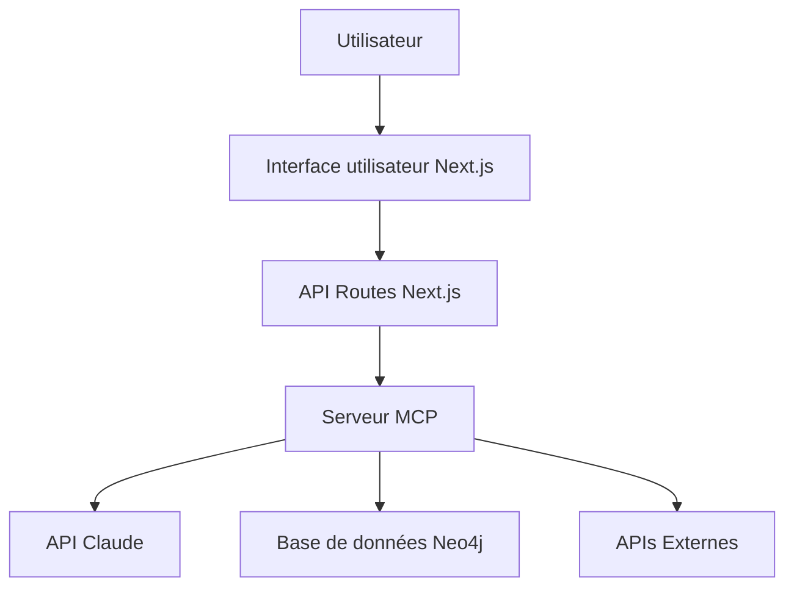

# Documentation technique - Knowledge Hub

Ce document détaille les choix d'implémentation techniques réalisés dans le cadre du développement du Knowledge Hub, avec pour objectif de maintenir un code propre, maintenable et évolutif.

## Table des matières

1. [Architecture générale](#architecture-générale)
2. [Frontend avec Next.js](#frontend-avec-nextjs)
3. [Système de dashboard et widgets](#système-de-dashboard-et-widgets)
4. [Composants UI et visualisations](#composants-ui-et-visualisations)
5. [Bonnes pratiques et conventions](#bonnes-pratiques-et-conventions)
6. [Points d'attention pour les développements futurs](#points-dattention-pour-les-développements-futurs)

## Architecture générale

Le Knowledge Hub est conçu selon une architecture modulaire pour permettre une évolution progressive des fonctionnalités. Les principaux composants de l'architecture sont :

- **Frontend (Next.js)** : Interface utilisateur avec système de dashboard et interaction conversationnelle
- **Backend (API routes Next.js)** : Endpoints pour la communication avec l'IA et la base de données
- **Serveur MCP** : Couche intermédiaire entre l'IA et les données
- **Base de données Neo4j** : Stockage des données sous forme de graphe



## Frontend avec Next.js

### Choix de Next.js 15 et App Router

Nous avons opté pour Next.js 15 avec l'App Router pour plusieurs raisons :

- **Server Components** : Prise en charge des React Server Components pour une meilleure performance initiale
- **API Routes** : Capacité à créer des endpoints backend directement dans la même base de code
- **Optimisations automatiques** : Code splitting, server-side rendering et optimisations d'images
- **Écosystème mature** : Large écosystème d'outils et bibliothèques compatibles

### Structure des dossiers

La structure des dossiers suit les meilleures pratiques recommandées pour Next.js App Router :

```
src/
├── app/                # Pages de l'application et mise en page globale
│   ├── globals.css     # Styles globaux
│   ├── layout.tsx      # Layout racine (thème sombre, polices)
│   └── page.tsx        # Page d'accueil
├── components/         # Composants réutilisables
│   ├── ui/             # Composants d'interface utilisateur de base (Shadcn)
│   ├── dashboard/      # Composants spécifiques au dashboard
│   └── ...             # Autres catégories de composants
└── lib/                # Hooks et utilitaires partagés
```

### Gestion des styles

Nous utilisons Tailwind CSS comme framework CSS-in-JS, avec les avantages suivants :

- **Approche utility-first** : Classes utilitaires qui réduisent la duplication de code CSS
- **Performance** : Génération optimisée de styles uniquement pour ce qui est utilisé
- **Thème cohérent** : Variables CSS centralisées pour les couleurs, espacements, etc.
- **Shadcn/ui** : Collection de composants réutilisables construits avec Tailwind et Radix UI

Pour le thème, nous avons configuré un thème sombre par défaut (adapté à l'utilisation d'une application de connaissances), avec des variables CSS soigneusement choisies pour assurer une cohérence visuelle dans l'ensemble de l'application.

## Système de dashboard et widgets

### react-grid-layout

Pour le tableau de bord, nous avons implémenté un système basé sur react-grid-layout qui offre :

- **Grille réactive** : Positionnement des widgets sur une grille virtuelle divisée en 12 colonnes
- **Drag & Drop** : Capacité à déplacer les widgets par glisser-déposer
- **Redimensionnement** : Redimensionnement des widgets dans toutes les directions
- **Persistance** : Sauvegarde de la disposition dans localStorage

### Architecture des widgets

Chaque widget dans le dashboard suit une architecture en couches :

1. **Widget Registration** : Configuration centrale des types de widgets disponibles
   ```typescript
   // Exemple de définition d'un widget dans le registre
   'chart': {
     component: SizableChart,
     defaultSize: { w: 8, h: 6 },
     minGridSize: { w: 5, h: 4 }
   }
   ```

2. **WidgetContainer** : Enveloppe commune pour tous les widgets définissant le style et les contrôles
   ```typescript
   <WidgetContainer 
     id={widget.id}
     title={widget.title}
     onRemove={removeWidget}
   >
     <WidgetComponent {...widget.props} />
   </WidgetContainer>
   ```

3. **SizableWidgetWrapper** : Gestion de la mesure du contenu pour un dimensionnement automatique
   ```typescript
   <SizableWidgetWrapper onSizeChange={handleSizeChange}>
     {children}
   </SizableWidgetWrapper>
   ```

4. **Contenu du widget** : Le composant spécifique au type de widget (graphique, table, etc.)

### Solution au défi du dimensionnement automatique

Un défi majeur a été le dimensionnement automatique des widgets. Nous avons mis en place un système qui :

1. Mesure la taille du contenu au moment du rendu initial
2. Convertit cette taille pixel en unités de grille avec une marge de sécurité
3. Applique des contraintes minimales basées sur le type de widget
4. Met à jour le layout du dashboard pour éviter les barres de défilement

Code clé pour la mesure et l'adaptation de taille :
```typescript
// Dans SizableWidgetWrapper.tsx
useEffect(() => {
  if (ref.current && !sizeReported.current) {
    const el = ref.current;
    const contentWidth = Math.max(el.scrollWidth, 300);
    const contentHeight = Math.max(el.scrollHeight, 200);
    
    onSizeChange({ width: contentWidth, height: contentHeight });
    sizeReported.current = true;
  }
}, [isMounted, onSizeChange]);
```

## Composants UI et visualisations

### Shadcn/ui comme base de composants

Nous avons choisi Shadcn/ui pour fournir une collection de composants UI réutilisables, pour plusieurs raisons :

- **Non-packagé** : Les composants sont copiés dans le code source, permettant une personnalisation totale
- **Accessibilité** : Construit sur Radix UI, garantissant une bonne accessibilité
- **Design minimaliste** : Apparence soignée, minimaliste et professionnelle
- **Extensibilité** : Facilement personnalisable avec Tailwind CSS

### Recharts pour les visualisations

Pour les visualisations de données, nous utilisons Recharts, une bibliothèque React de graphiques qui offre :

- **API déclarative** : API simple et déclarative basée sur des composants React
- **Personnalisation** : Contrôle total sur l'apparence des graphiques
- **Performance** : Rendu efficace basé sur SVG
- **Animations** : Transitions animées fluides entre les états de données

Défis rencontrés et solutions :
- **Compatibilité avec React 18** : Nous sommes passés de React 19 à React 18 pour garantir la compatibilité avec Recharts
- **Rendu côté serveur** : Utilisation de composants client explicites pour les graphiques avec "use client"

## Bonnes pratiques et conventions

### Structure des composants React

Nous suivons ces conventions pour les composants React :

1. **Naming** : 
   - PascalCase pour les noms de composants
   - camelCase pour les fonctions et variables
   - Noms descriptifs (ex: `WidgetContainer` plutôt que `Container`)

2. **Organisation des imports** :
   ```typescript
   // Bibliothèques externes d'abord
   import React, { useState, useEffect } from 'react';
   import { Card } from '@/components/ui/card';
   
   // Composants internes ensuite
   import { WidgetHeader } from './WidgetHeader';
   
   // Types et utilitaires en dernier
   import type { Widget } from '@/types';
   import { cn } from '@/lib/utils';
   ```

3. **Préférence pour les fonctions composants** :
   ```typescript
   export function MyComponent({ prop1, prop2 }: MyComponentProps) {
     // Corps du composant
     return <div>...</div>;
   }
   ```

4. **Props typées explicitement** :
   ```typescript
   interface ButtonProps {
     variant?: 'primary' | 'secondary';
     size?: 'sm' | 'md' | 'lg';
     children: React.ReactNode;
     onClick?: () => void;
   }
   ```

### État et effets secondaires

- **État local** : Utiliser `useState` pour l'état local dans les composants 
- **Effets** : Limiter l'utilisation de `useEffect` et veiller à spécifier correctement les dépendances
- **Contextes** : Utiliser les contextes React pour partager l'état global quand nécessaire

Exemple de gestion d'état propre :
```typescript
// ✅ Bon exemple - dépendances claires
useEffect(() => {
  if (!containerRef.current) return;
  
  const updateWidth = () => {
    if (containerRef.current) {
      setWidth(containerRef.current.offsetWidth);
    }
  };
  
  updateWidth();
  const resizeObserver = new ResizeObserver(updateWidth);
  resizeObserver.observe(containerRef.current);
  
  return () => resizeObserver.disconnect();
}, []);
```

### Organisation du CSS

- Utiliser les classes Tailwind CSS directement dans les composants
- Éviter le CSS global sauf pour les styles de base et les animations
- Utiliser les fonctions utilitaires `cn` pour combiner des classes de manière conditionnelle
- Pour les widgets du dashboard, nous utilisons des CSS Modules pour encapsuler les styles spécifiques

## Points d'attention pour les développements futurs

### Passage à l'échelle

Pour garantir que l'application reste performante à mesure qu'elle se développe :

1. **Lazy loading** : Utiliser `React.lazy` et `Suspense` pour le chargement asynchrone des composants
2. **Code splitting** : Tirer parti du code splitting automatique de Next.js
3. **Memoization** : Utiliser `useMemo` et `React.memo` pour les calculs ou rendus coûteux
4. **Virtualisation** : Pour les longues listes, envisager d'utiliser une bibliothèque de virtualisation

### Interaction backend

À mesure que l'intégration avec Neo4j et l'IA Claude progresse :

1. **Type safety** : Assurer la cohérence des types entre frontend et backend
2. **React Query** (Tanstack Query) : Envisager d'utiliser React Query pour la gestion de l'état serveur et du cache
3. **Gestion d'erreurs** : Mettre en place un système robuste de gestion et d'affichage des erreurs
4. **Rate limiting** : Prévoir des mécanismes pour limiter les requêtes à l'API Claude

### Tests

À implémenter dans les phases futures :

1. **Tests unitaires** : Jest + React Testing Library
2. **Tests d'intégration** : Cypress ou Playwright
3. **Tests de snapshot** : Pour les composants UI
4. **Storybook** : Pour la documentation des composants visuels

---

Cette documentation technique présente les fondations du projet Knowledge Hub. En suivant ces conventions et bonnes pratiques, nous assurerons une évolution harmonieuse du projet tout en maintenant un code propre et maintenable.
