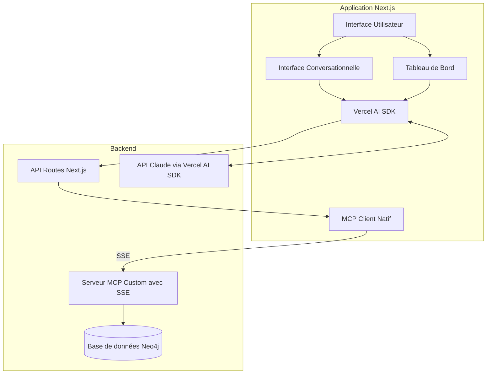

# Intégration du Vercel AI SDK dans Knowledge Hub

Ce document décrit comment Knowledge Hub utilise Vercel AI SDK 4.2+ pour simplifier et améliorer les interactions entre le frontend Next.js, le serveur MCP et Claude.

## Table des matières

1. [Introduction au Vercel AI SDK](#introduction-au-vercel-ai-sdk)
2. [Architecture d'intégration](#architecture-dintégration)
3. [Composants clés](#composants-clés)
4. [Implémentation de chat avec Claude](#implémentation-de-chat-avec-claude)
5. [Support MCP natif](#support-mcp-natif)
6. [Outils vs Approche traditionnelle](#outils-vs-approche-traditionnelle)
7. [Améliorations futures](#améliorations-futures)

## Introduction au Vercel AI SDK

Vercel AI SDK est une bibliothèque qui simplifie l'intégration des grands modèles de langage (LLMs) comme Claude dans les applications web. Dans le contexte de Knowledge Hub, elle offre plusieurs avantages :

- **Hooks React optimisés** (`useChat`) pour l'interface de chat
- **Streaming de réponses** efficace et typographié
- **Support natif du Model Context Protocol (MCP)** via `experimental_createMCPClient`
- **Gestion des types de contenu** via un système de "message parts"
- **Support pour les appels d'outils** et leurs résultats

Le SDK réduit considérablement la quantité de code personnalisé nécessaire et améliore la robustesse et la maintenabilité.

## Architecture d'intégration



## Composants clés

### 1. MCP Client natif du SDK

Le SDK Vercel AI fournit une implémentation native du client MCP qui remplace notre implémentation personnalisée :

```typescript
// Ancienne approche avec implémentation personnalisée
const mcpClient = new MCPClientWrapper();
const response = await mcpClient.sendRequest({...});

// Nouvelle approche avec Vercel AI SDK
const mcpClient = await experimental_createMCPClient({
  transport: {
    type: 'sse',
    url: process.env.MCP_SERVER_URL
  }
});
const mcpTools = await mcpClient.tools();
```

### 2. Hook useChat

Le hook `useChat` gère toute la logique d'interface pour le chat :

```typescript
// Implémentation simple du chat avec useChat
const { messages, input, handleInputChange, handleSubmit, status } = useChat({
  api: '/api/chat',
  id: 'knowledge-hub-chat'
});
```

Ce hook fournit :
- Gestion de l'état des messages
- Soumission des messages
- Streaming des réponses
- Indicateurs de statut
- Support pour les "message parts" (texte, appels d'outils, etc.)

### 3. Streaming avancé

Le SDK offre des fonctions de streaming optimisées :

```typescript
// Dans l'API route
const result = await streamText({
  model: anthropic('claude-3-5-sonnet-20240620'),
  messages,
  tools: mcpTools,
  // ...
});

return result.toDataStreamResponse();
```

## Implémentation de chat avec Claude

### 1. Côté client (Interface utilisateur)

```tsx
// Composant ChatInterface.tsx
"use client";

import { useChat } from '@ai-sdk/react';
import { useState, useRef, useEffect } from 'react';

export default function ChatInterface() {
  const { messages, input, handleInputChange, handleSubmit, status } = useChat({
    api: '/api/chat',
    id: 'knowledge-hub-chat',
  });
  
  // Rendu des messages avec support pour différents types de contenu
  return (
    <div className="flex flex-col h-full">
      <div className="flex-1 overflow-y-auto p-4 space-y-4">
        {messages.map((message) => (
          <div key={message.id} className="...">
            {message.parts.map((part, i) => {
              if (part.type === 'text') {
                return <div key={i}>{part.text}</div>;
              } else if (part.type === 'tool-invocation') {
                // Affichage des appels d'outils
                return <div key={i}>Tool: {part.toolInvocation.toolName}</div>;
              }
              return null;
            })}
          </div>
        ))}
      </div>
      
      {/* Formulaire de saisie */}
      <form onSubmit={handleSubmit}>
        <input value={input} onChange={handleInputChange} />
        <button type="submit">Envoyer</button>
      </form>
    </div>
  );
}
```

### 2. Côté serveur (API route)

```typescript
// API route /api/chat/route.ts
import { anthropic } from '@ai-sdk/anthropic';
import { streamText, experimental_createMCPClient } from 'ai';
import { NextResponse } from 'next/server';

export async function POST(req: Request) {
  try {
    const { messages } = await req.json();
    
    // Créer un client MCP
    const mcpClient = await experimental_createMCPClient({
      transport: {
        type: 'sse',
        url: process.env.MCP_SERVER_URL || 'http://localhost:3001/mcp/sse',
      },
    });
    
    try {
      // Récupérer les outils disponibles
      const mcpTools = await mcpClient.tools();
      
      // Utiliser streamText pour générer la réponse
      const result = await streamText({
        model: anthropic('claude-3-5-sonnet-20240620'),
        messages,
        tools: mcpTools,
        system: "Vous êtes un assistant pour le Knowledge Hub...",
        maxSteps: 3, // Permettre jusqu'à 3 étapes pour les appels d'outils
        onFinish: async () => {
          // Fermer le client MCP
          await mcpClient.close();
        },
      });
      
      return result.toDataStreamResponse();
    } catch (error) {
      await mcpClient.close();
      throw error;
    }
  } catch (error) {
    console.error('Erreur dans l\'API de chat:', error);
    return NextResponse.json(
      { error: 'Erreur lors du traitement de la demande' },
      { status: 500 }
    );
  }
}
```

## Support MCP natif

Vercel AI SDK 4.2+ introduit un support natif pour le Model Context Protocol (MCP) :

### 1. Avantages du support MCP natif

- **Découverte automatique des outils** : Le client MCP récupère automatiquement les outils disponibles
- **SSE (Server-Sent Events)** : Support natif pour le streaming bidirectionnel
- **Gestion de la session** : Gestion automatique du cycle de vie des sessions
- **Typage** : Support TypeScript complet pour les outils et leurs paramètres

### 2. Configuration du serveur MCP pour SSE

Pour fonctionner avec le client MCP du SDK, notre serveur MCP doit :

1. Exposer un endpoint SSE (Server-Sent Events)
2. Implémenter la notification d'initialisation conforme au protocole MCP
3. Gérer les connexions persistantes

```javascript
// Exemple d'implémentation d'un endpoint SSE dans le serveur MCP
app.get('/mcp/sse', (req, res) => {
  res.setHeader('Content-Type', 'text/event-stream');
  res.setHeader('Cache-Control', 'no-cache');
  res.setHeader('Connection', 'keep-alive');
  res.setHeader('Access-Control-Allow-Origin', '*');

  // Envoyer une notification d'initialisation
  res.write(`data: ${JSON.stringify({
    jsonrpc: "2.0",
    method: "initialize",
    params: {
      protocolVersion: "2025-03-26",
      capabilities: {
        tools: {
          listChanged: true
        }
      },
      serverInfo: {
        name: "KnowledgeHubMCPServer",
        version: "0.1.0"
      }
    }
  })}\n\n`);

  // Gestionnaire de déconnexion
  req.on('close', () => {
    console.log('Client SSE déconnecté');
  });
});
```

## Outils vs Approche traditionnelle

### Comparaison des approches

| Aspect | Approche traditionnelle | Approche Vercel AI SDK |
|--------|--------------------------|------------------------|
| **Complexité** | Implémentation manuelle du client MCP, gestion personnalisée des messages et réponses | Utilisation de hooks et fonctions prêts à l'emploi |
| **Lignes de code** | ~500-1000 lignes pour un système complet | ~100-200 lignes pour les mêmes fonctionnalités |
| **Maintenabilité** | Nécessite la maintenance de code personnalisé | Se base sur une bibliothèque maintenue par Vercel |
| **Performances** | Variable selon l'implémentation | Optimisée pour les cas d'usage d'IA |
| **Typage** | Nécessite une définition manuelle des types | Types intégrés et documentation complète |
| **Évolutivité** | Nécessite des extensions personnalisées | API extensible, support pour de nouvelles fonctionnalités |

### Composants rendus obsolètes

L'adoption du Vercel AI SDK rend certains composants personnalisés obsolètes :

1. **MCPClientWrapper** : Remplacé par `experimental_createMCPClient`
2. **useChat personnalisé** : Remplacé par le hook `useChat` du SDK
3. **Logique de streaming personnalisée** : Remplacée par `streamText` et `toDataStreamResponse`
4. **Gestion manuelle des messages** : Remplacée par le système de messages et "parts" du SDK

## Améliorations futures

Le Vercel AI SDK ouvre la voie à plusieurs améliorations potentielles :

1. **Widgets dynamiques** : Génération de composants UI dynamiques via l'API Generative UI
2. **Outils côté client** : Exécution d'outils directement dans le navigateur
3. **Communication multi-streams** : Support pour plusieurs conversations parallèles
4. **Intégration d'autres modèles** : Support facile pour d'autres LLMs comme OpenAI, Anthropic, etc.
5. **Composants React Server** : Intégration potentielle avec React Server Components

---

Cette documentation décrit l'intégration actuelle du Vercel AI SDK dans Knowledge Hub. À mesure que le SDK évolue et que de nouvelles fonctionnalités sont introduites, cette documentation sera mise à jour pour refléter les meilleures pratiques d'intégration.
